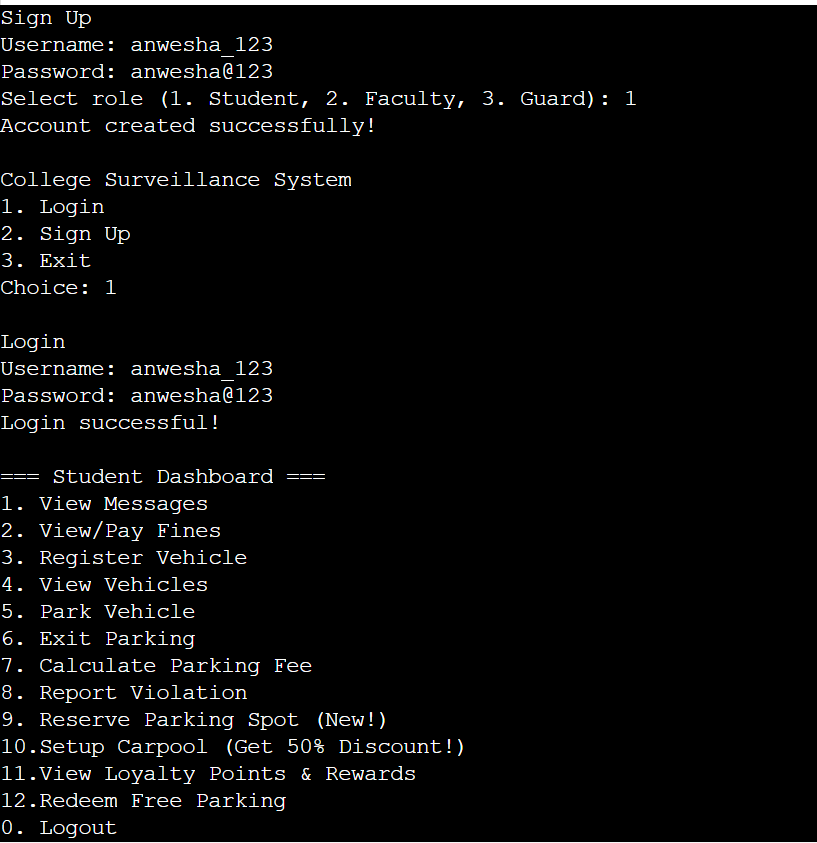
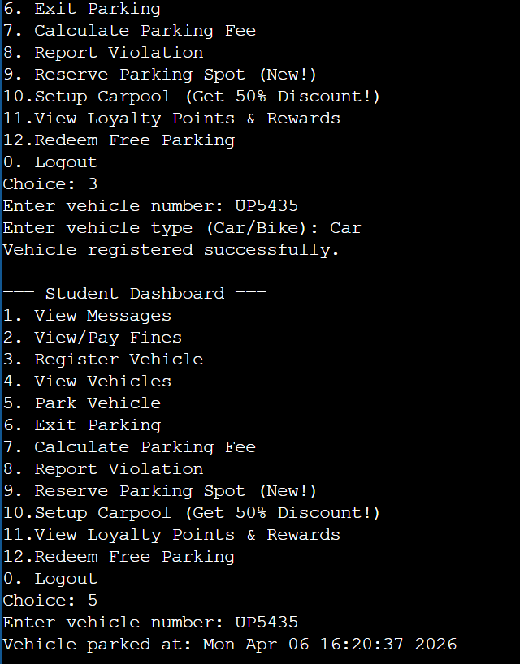

# Vehicle-Surveillance-System
Smart campus parking and surveillance system using Java OOPS
# Features
- Parking slot management  
- Reservation system with expiry  
- Carpool discount system  
- Loyalty points and rewards  
- Violation detection  
- Fine management system  
## Output Screenshots

### Login & Dashboard

### Parking & Fee Calculation

# Concepts Used
- Object-Oriented Programming (OOP)  
- ArrayList, HashMap  
- Date-Time API  

# Why this project?
This project demonstrates real-world system design using Java and showcases practical implementation of OOP concepts.
